# 🏗️ AI Geospatial Analyst - Complete Architecture

> Detailed architecture diagrams showing the actual implementation flow from user query to final output

---

## 📋 Table of Contents

1. [Complete System Architecture](#complete-system-architecture)
2. [Query Execution Flow](#query-execution-flow)
3. [Component Architecture](#component-architecture)
4. [Task Queue Execution Detail](#task-queue-execution-detail)
5. [Data Flow Architecture](#data-flow-architecture)
6. [State Management](#state-management)

---

## 🎯 Complete System Architecture

### High-Level Component Flow


---

## 🔄 Query Execution Flow (Task Queue Architecture)

### Complete End-to-End Flow

```mermaid
graph TB
    Start([User Query:<br/>"Find schools near parks in Berlin"])
    
    subgraph "Phase 1: Parsing & Validation"
        P1[QueryParser.parse]
        P2{Valid Query?}
        P3[Extract: target='school'<br/>location='Berlin, Germany'<br/>constraints=['park', 'near']]
    end
    
    subgraph "Phase 2: Data Intelligence"
        S1[DataScout.generate_report]
        S2[Probe: school in Berlin]
        S3[Probe: park in Berlin]
        S4[OSM Taginfo API]
        S5[DataRealityReport:<br/>school: 1,236 items<br/>park: 2,978 items]
    end
    
    subgraph "Phase 3: Execution Planning"
        PL1[ExecutionPlanner.plan]
        PL2[RAG: Get similar workflows]
        PL3[Identify Tasks:<br/>1. Load schools<br/>2. Load constraint park<br/>3. Buffer park<br/>4. Spatial join<br/>5. Finish]
        PL4[Resolve Tags from Report:<br/>school → amenity=school<br/>park → leisure=park]
        PL5[Generate TaskQueue<br/>5 immutable tasks]
    end
    
    subgraph "Phase 4: Task Execution Loop"
        E1[TaskExecutor.execute_task_queue]
        E2[Initialize ExecutionState]
        E3{More Tasks?}
        E4[Get Next Task]
        E5[_execute_single_task]
        
        subgraph "Single Task Execution"
            ST1{Virtual Tool?}
            ST2[Get Single Tool Definition]
            ST3[Resolve Task Parameters<br/>Replace task references]
            ST4[Build Single-Tool Prompt]
            ST5[Call LLM<br/>Refine parameters only]
            ST6[Execute Tool via<br/>WorkflowExecutor]
            ST7[Detect Output Layer Name]
            ST8{Name Mismatch?}
            ST9[Force Rename Layer]
            ST10[Update ExecutionState]
        end
    end
    
    subgraph "Phase 5: Tool Execution"
        T1[WorkflowExecutor.execute_single_step]
        T2{Tool Type?}
        T3[load_osm_data]
        T4[buffer]
        T5[spatial_join]
        T6[Smart DataLoader]
        T7[GeoPandas Operations]
        T8[Return: observation + layers]
    end
    
    subgraph "Phase 6: State Management"
        SM1[Update available_layers]
        SM2[Record task_outputs]
        SM3[Track completed_tasks]
    end
    
    Final([Final Result:<br/>4,000 schools near parks<br/>Execution log<br/>Reasoning history])
    
    Start --> P1
    P1 --> P2
    P2 -->|Yes| P3
    P2 -->|No| Error1[Return Error]
    
    P3 --> S1
    S1 --> S2
    S1 --> S3
    S2 --> S4
    S3 --> S4
    S4 --> S5
    
    S5 --> PL1
    PL1 --> PL2
    PL2 --> PL3
    PL3 --> PL4
    PL4 --> PL5
    
    PL5 --> E1
    E1 --> E2
    E2 --> E3
    E3 -->|Yes| E4
    E3 -->|No| Final
    E4 --> E5
    
    E5 --> ST1
    ST1 -->|Yes<br/>finish_task| ST10
    ST1 -->|No| ST2
    ST2 --> ST3
    ST3 --> ST4
    ST4 --> ST5
    ST5 --> ST6
    
    ST6 --> T1
    T1 --> T2
    T2 --> T3
    T2 --> T4
    T2 --> T5
    T3 --> T6
    T4 --> T7
    T5 --> T7
    T6 --> T8
    T7 --> T8
    
    T8 --> ST7
    ST7 --> ST8
    ST8 -->|Yes| ST9
    ST8 -->|No| ST10
    ST9 --> ST10
    
    ST10 --> SM1
    SM1 --> SM2
    SM2 --> SM3
    SM3 --> E3
    
    style PL5 fill:#90EE90
    style E5 fill:#87CEEB
    style ST6 fill:#FFD700
    style SM1 fill:#DDA0DD
```

---

## 🧩 Component Architecture

### Detailed Component Interaction

```mermaid
graph LR
    subgraph "User Interface Layer"
        CLI[analyst.py]
    end
    
    subgraph "Orchestration Layer"
        MO[MasterOrchestrator]
        MO_init[__init__<br/>use_task_queue flag]
        MO_run[run method<br/>Coordinates all phases]
    end
    
    subgraph "Query Processing"
        QP[QueryParser]
        QP_parse[parse<br/>Extracts entities]
        QP_nlp[spaCy NLP<br/>Entity recognition]
    end
    
    subgraph "Data Intelligence"
        DS[DataScout]
        DS_probe[probe_data<br/>Check OSM availability]
        DS_report[generate_report<br/>DataRealityReport]
        
        TM[OSMTagManager]
        TM_resolve[resolve_tag<br/>Taginfo API query]
        TM_cache[Tag cache<br/>Popular tags]
    end
    
    subgraph "Planning Components"
        EP[ExecutionPlanner]
        EP_plan[plan method<br/>Main entry]
        EP_primary[_plan_primary_task<br/>Load main entity]
        EP_constraint[_plan_constraint_tasks<br/>Load + process constraints]
        EP_tags[_get_tags_from_report<br/>Only successful probes]
        
        RAG_SYS[RAG System]
        RAG_query[query_knowledge<br/>Vector similarity search]
        RAG_embed[Embeddings<br/>sentence-transformers]
    end
    
    subgraph "Execution Components"
        TE[TaskExecutor]
        TE_queue[execute_task_queue<br/>Main loop]
        TE_single[_execute_single_task<br/>Single-tool isolation]
        TE_prompt[_build_single_tool_prompt<br/>ONE tool only]
        TE_resolve[_resolve_task_parameters<br/>Replace [task_id]]
        TE_llm[_call_llm<br/>Ollama HTTP API]
        
        WE[WorkflowExecutor]
        WE_step[execute_single_step<br/>Tool dispatcher]
        WE_log[Reasoning log<br/>Track all actions]
    end
    
    subgraph "Tool Components"
        TR[TOOL_REGISTRY<br/>Dictionary]
        TR_get[get_tool_by_name<br/>Lookup function]
        
        T1[load_osm_data_tool<br/>ToolDefinition]
        T2[buffer_tool<br/>ToolDefinition]
        T3[spatial_join_tool<br/>ToolDefinition]
        T4[filter_features_tool<br/>ToolDefinition]
    end
    
    subgraph "Data Access"
        DL[SmartDataLoader]
        DL_load[load_osm_data<br/>Fetch or cache]
        DL_cache[Cache check<br/>GeoPackage]
        DL_fetch[Fetch from OSM<br/>osmnet/requests]
    end
    
    CLI --> MO
    MO --> MO_init
    MO --> MO_run
    
    MO_run --> QP
    QP --> QP_parse
    QP_parse --> QP_nlp
    
    MO_run --> DS
    DS --> DS_probe
    DS_probe --> TM
    TM --> TM_resolve
    TM_resolve --> TM_cache
    DS --> DS_report
    
    MO_run --> EP
    EP --> EP_plan
    EP_plan --> RAG_SYS
    RAG_SYS --> RAG_query
    RAG_query --> RAG_embed
    EP_plan --> EP_primary
    EP_plan --> EP_constraint
    EP_constraint --> EP_tags
    
    MO_run --> TE
    TE --> TE_queue
    TE_queue --> TE_single
    TE_single --> TE_prompt
    TE_single --> TE_resolve
    TE_single --> TE_llm
    TE_single --> WE
    
    WE --> WE_step
    WE_step --> TR
    TR --> TR_get
    TR --> T1
    TR --> T2
    TR --> T3
    TR --> T4
    
    T1 --> DL
    DL --> DL_load
    DL_load --> DL_cache
    DL_load --> DL_fetch
    
    style EP fill:#90EE90
    style TE fill:#87CEEB
    style TR fill:#FFD700
    style DL fill:#DDA0DD
```

---

## 🔁 Task Queue Execution Detail

### Single Task Execution Lifecycle

```mermaid
sequenceDiagram
    participant Executor as TaskExecutor
    participant State as ExecutionState
    participant LLM as Ollama LLM
    participant WE as WorkflowExecutor
    participant Tool as GIS Tool
    participant OSM as OpenStreetMap
    
    Note over Executor: Task: "Load schools in Berlin"<br/>ID: task_1<br/>Tool: load_osm_data
    
    rect rgb(200, 230, 200)
        Note over Executor,State: PHASE 1: PREPARATION
        Executor->>Executor: Check if virtual tool (finish_task)
        Executor->>Executor: Get single tool definition from TOOL_REGISTRY
        Executor->>State: Get current available_layers
        Executor->>Executor: Resolve task parameters<br/>Replace [task_2] → actual layer name
    end
    
    rect rgb(200, 220, 255)
        Note over Executor,LLM: PHASE 2: LLM PARAMETER REFINEMENT
        Executor->>Executor: Build single-tool prompt<br/>ONLY load_osm_data definition<br/>Suggested params: {tags, area_name}
        Executor->>LLM: POST /api/generate<br/>Prompt + ONE tool
        Note over LLM: LLM can ONLY refine params<br/>Cannot choose different tool<br/>Cannot skip task
        LLM-->>Executor: Refined params:<br/>{tags: {amenity: school}, area_name: "Berlin, Germany"}
    end
    
    rect rgb(255, 240, 200)
        Note over Executor,OSM: PHASE 3: TOOL EXECUTION
        Executor->>Executor: Snapshot existing layers (before)
        Executor->>WE: execute_single_step(tool_call, current_layers)
        WE->>Tool: Call load_osm_data function
        Tool->>OSM: Overpass API query<br/>amenity=school in Berlin
        OSM-->>Tool: GeoDataFrame (1,081 features)
        Tool-->>WE: observation + updated_layers
        WE-->>Executor: Success: Loaded 1,081 schools
    end
    
    rect rgb(255, 220, 255)
        Note over Executor,State: PHASE 4: STATE UPDATE
        Executor->>Executor: Compare layers (after - before)
        Executor->>Executor: Detect new layer: load_osm_data_output_1
        
        alt Layer name mismatch
            Executor->>Executor: Expected: school_berlin_germany<br/>Actual: load_osm_data_output_1
            Executor->>Executor: FORCE RENAME<br/>output_1 → school_berlin_germany
            Note over Executor: Fix layer naming mismatch
        end
        
        Executor->>State: Update available_layers<br/>+school_berlin_germany
        Executor->>State: Record task_outputs<br/>task_1 → school_berlin_germany
        Executor->>State: Add to completed_tasks<br/>+task_1
    end
    
    rect rgb(220, 255, 220)
        Note over Executor,State: PHASE 5: RESULT
        Executor-->>Executor: Return TaskResult<br/>success=True<br/>output_layer=school_berlin_germany
        Note over State: State ready for next task
    end
```



---

## 📊 Data Flow Architecture

### Data Transformation Pipeline


---

## 🗄️ State Management

### ExecutionState Structure & Updates

```mermaid
graph TB
    subgraph "ExecutionState Data Structure"
        ES[ExecutionState]
        AL[available_layers:<br/>Dict[str, GeoDataFrame]]
        TO[task_outputs:<br/>Dict[str, str]<br/>Maps task_id → layer_name]
        CT[completed_tasks:<br/>List[str]<br/>Task IDs in order]
        
        ES --> AL
        ES --> TO
        ES --> CT
    end
    
    subgraph "State Update Flow"
        TaskStart[Task Execution Starts]
        Execute[Execute Tool]
        Result[Task Result]
        
        Update1[Update available_layers<br/>Add/modify GeoDataFrames]
        Update2[Record task_outputs<br/>task_id → output_layer_name]
        Update3[Append to completed_tasks<br/>Track progress]
        
        TaskStart --> Execute
        Execute --> Result
        Result --> Update1
        Update1 --> Update2
        Update2 --> Update3
    end
    
    subgraph "Task Parameter Resolution"
        Param["Parameter: {layer: '[task_2]'}"]
        Lookup[Look up task_outputs[task_2]]
        Resolve["Resolved: {layer: 'park_berlin_germany'}"]
        
        Param --> Lookup
        Lookup --> TO
        Lookup --> Resolve
    end
    
    subgraph "Layer Name Synchronization"
        ToolReturn[Tool returns:<br/>load_osm_data_output_1]
        PlanExpect[Plan expects:<br/>school_berlin_germany]
        Check{Names match?}
        Rename[Force rename layer<br/>in available_layers]
        UpdateResult[Update TaskResult<br/>output_layer_name]
        
        ToolReturn --> Check
        PlanExpect --> Check
        Check -->|No| Rename
        Check -->|Yes| UpdateResult
        Rename --> UpdateResult
        UpdateResult --> AL
    end
    
    style ES fill:#DDA0DD
    style TO fill:#FFD700
    style Rename fill:#FF6B6B
```

---

## 📦 Tool Registry Architecture

### Tool Definition & Execution

```mermaid
graph TB
    subgraph "Tool Registry (definitions.py)"
        Registry[TOOL_REGISTRY<br/>Dict[str, ToolDefinition]]
        
        T1Def["load_osm_data_tool<br/>ToolDefinition"]
        T1Name[operation_name: 'load_osm_data']
        T1Desc[description: 'Fetch OSM data...']
        T1Params[parameters: [tags, area_name]]
        T1Func[tool_function: load_osm_data]
        
        Registry --> T1Def
        T1Def --> T1Name
        T1Def --> T1Desc
        T1Def --> T1Params
        T1Def --> T1Func
    end
    
    subgraph "Tool Lookup Process"
        GetTool[get_tool_by_name<br/>'load_osm_data']
        SearchReg[Search TOOL_REGISTRY]
        FindDef[Return ToolDefinition]
        
        GetTool --> SearchReg
        SearchReg --> Registry
        SearchReg --> FindDef
    end
    
    subgraph "Single-Tool Isolation"
        Prompt[Build Prompt]
        OnlyOne["Include ONLY ONE tool definition<br/>(not entire registry)"]
        LLMSees["LLM sees:<br/>- Tool name<br/>- Description<br/>- Parameters<br/>- Suggested values"]
        LLMCannot["LLM CANNOT see:<br/>- Other tools<br/>- Tool registry<br/>- Alternative choices"]
        
        Prompt --> OnlyOne
        OnlyOne --> LLMSees
        OnlyOne --> LLMCannot
    end
    
    subgraph "Tool Execution"
        Execute[WorkflowExecutor.execute_single_step]
        Dispatch[Dispatch to tool_function]
        Call[Call Python function]
        Return[Return: observation + layers]
        
        Execute --> Dispatch
        Dispatch --> T1Func
        Dispatch --> Call
        Call --> Return
    end
    
    FindDef --> Prompt
    LLMSees --> Execute
    
    style Registry fill:#FFD700
    style OnlyOne fill:#90EE90
    style LLMCannot fill:#FF6B6B
```

---

## 🔄 Complete Example: "Find schools near parks in Berlin"

### Step-by-Step Execution Trace

```mermaid
graph TB
    Start([User Query])
    
    P[Parse Query<br/>target: school<br/>location: Berlin<br/>constraint: park near]
    
    S[Scout Data<br/>Probe school: 1,236 ✓<br/>Probe park: 2,978 ✓]
    
    PL[Plan Tasks<br/>Generate 5-task queue]
    
    T1[Execute Task 1<br/>load_osm_data<br/>tags: {amenity: school}<br/>→ 1,081 schools loaded]
    
    T2[Execute Task 2<br/>load_osm_data<br/>tags: {leisure: park}<br/>→ 2,679 parks loaded]
    
    T3[Execute Task 3<br/>buffer<br/>layer: park_berlin_germany<br/>distance: 500m<br/>→ 2,679 buffered polygons]
    
    T4[Execute Task 4<br/>spatial_join<br/>left: schools<br/>right: park_buffers<br/>predicate: intersects<br/>→ 4,000 schools found!]
    
    T5[Execute Task 5<br/>finish_task<br/>→ Workflow complete]
    
    Output([Output:<br/>4,000 schools<br/>within 500m of parks<br/>Execution time: 35s])
    
    Start --> P
    P --> S
    S --> PL
    PL --> T1
    T1 --> T2
    T2 --> T3
    T3 --> T4
    T4 --> T5
    T5 --> Output
    
    style PL fill:#90EE90
    style T4 fill:#FFD700
    style Output fill:#87CEEB
```

---

## 📊 Architecture Comparison: Before vs After

### Legacy Flat Loop (Before)


### Task Queue (After)


---

## 🎓 Key Architectural Principles

### 1. Separation of Concerns

| Component | Responsibility | NOT Responsible For |
|-----------|---------------|---------------------|
| **Parser** | NL → Structure | Data validation |
| **Scout** | Data availability | Execution planning |
| **Planner** | Generate queue | Execute tasks |
| **Executor** | Run tasks | Decide workflow |
| **Tools** | Atomic operations | Combining operations |

### 2. Immutability

```python
# Task Queue is IMMUTABLE after planning
task_queue = planner.generate_queue(query)  # Generated ONCE
# Cannot be modified during execution
# Ensures deterministic, reproducible results
```

### 3. Explicit State Passing

```python
# State is passed explicitly, never global
state = ExecutionState(available_layers={})

for task in task_queue:
    result = executor.execute_single_task(task, state)
    state = update_state(result)  # New state, not mutation
```

### 4. Single Responsibility per Task

```python
# Each task does ONE thing
Task(tool_name="load_osm_data", ...)   # Only loads data
Task(tool_name="buffer", ...)           # Only buffers
Task(tool_name="spatial_join", ...)    # Only joins

# NOT allowed:
Task(tool_name="load_and_buffer", ...) # Multiple responsibilities
```

---

**Architecture designed for determinism, debuggability, and maintainability.**

*Document Version: 1.0*  
*Last Updated: 2025-11-21*  
*Author: Suman Patra*
