# 🚀 Development Journey: AI Geospatial Analyst

> A chronicle of building a deterministic LLM agent system that eliminates infinite loops through architectural innovation

---

## 📖 Table of Contents

1. [Vision & Motivation](#vision--motivation)
2. [The Core Problem](#the-core-problem)
3. [Architecture Evolution](#architecture-evolution)
4. [Problems Faced & Solutions](#problems-faced--solutions)
5. [System Architecture](#system-architecture)
6. [Process Flows](#process-flows)
7. [Use Case Diagrams](#use-case-diagrams)
8. [Lessons Learned](#lessons-learned)

> 📐 **For detailed architecture diagrams and complete workflow visualization, see [ARCHITECTURE.md](ARCHITECTURE.md)**

---

## 🎯 Vision & Motivation

### The Dream

**Imagine asking your computer:**
> "Show me all schools within walking distance of parks in Berlin"

**And receiving:**
- A map with 4,000 precisely located schools
- Near parks with proper 500m buffers
- All gathered and analyzed in under 60 seconds
- **Without a single line of GIS code**

This is the vision: **Democratizing geospatial analysis through natural language.**

### Why It Matters

Traditional GIS workflows require:
- ❌ Expert knowledge of spatial databases
- ❌ Programming skills (Python, SQL, R)
- ❌ Understanding of coordinate systems
- ❌ Manual data cleaning and preparation

**Our vision:** Anyone should be able to analyze spatial data with simple questions.

---

## 💥 The Core Problem

### The "Doom Loop" Phenomenon

When we first built the system using a traditional **ReAct (Reasoning-Action) loop**, we discovered a catastrophic failure mode:

```
User: "Find schools near parks in Berlin"

LLM Agent:
  Step 1: Load schools ✅
  Step 2: Load parks ✅
  Step 3: Load schools ❌ (DUPLICATE!)
  Step 4: Load schools ❌ (DUPLICATE!)
  Step 5: Load schools ❌ (DUPLICATE!)
  ... INFINITE LOOP ...
```

### Why This Happens


**Root Causes:**

1. **Probabilistic Decision-Making**: LLMs sample actions, leading to non-deterministic choices
2. **Context Drift**: Long histories cause the LLM to "forget" completed actions
3. **Success Bias**: Seeing "Success: Loaded schools" statistically biases the LLM to repeat that action
4. **Tool Hallucination**: With full tool access, the LLM can invent incorrect operation sequences

---

## 🏗️ Architecture Evolution

### Phase 1: Flat ReAct Loop (Failed ❌)


**Architecture:**
```python
while not finished:
    action = llm.decide(history, all_tools)  # LLM has full control
    result = execute(action)
    history.append(result)
```

**Problems:**
- LLM can choose ANY tool at ANY time
- No deterministic progression guarantee
- Context accumulates indefinitely
- **Result: Infinite loops in 80% of complex queries**

---

### Phase 2: Task Queue with Single-Tool Isolation (Success ✅)


**Architecture:**
```python
# PLANNING PHASE (runs ONCE)
task_queue = planner.generate_queue(query)

# EXECUTION PHASE (deterministic loop)
state = ExecutionState()
for task in task_queue:
    # LLM sees ONLY ONE tool
    result = executor.execute_single_task(task, state)
    state = update_state(result)
```

**Breakthrough Insights:**

1. **Separation of Concerns**: Planning vs. Execution
2. **Single-Tool Isolation**: Each task physically cannot access other tools
3. **Explicit State Passing**: No accumulating history
4. **Python-Controlled Flow**: LLM refines parameters, Python controls sequence

---

## 🔥 Problems Faced & Solutions

### Problem 1: Infinite Doom Loops

**Symptom:**
```
[INFO] Loading schools... SUCCESS
[INFO] Loading schools... SUCCESS  # DUPLICATE!
[INFO] Loading schools... SUCCESS  # DUPLICATE!
(repeats 100+ times)
```

**Solution: Deterministic Task Queue**


**Implementation:**
- Planner generates complete task queue upfront
- Python `for` loop ensures finite execution
- Tasks cannot repeat (queue is immutable)

**Files Modified:**
- `src/core/planners/execution_planner.py` (NEW)
- `src/core/orchestrator.py` (refactored)

---

### Problem 2: Fragile Task References

**Symptom:**
```python
# Planner generates:
task_id = "load_schools_berlin_1"

# Executor tries:
primary_ref = task_id.split('_')[1]  # Assumes format!
# Breaks if ID format changes!
```

**Solution: Direct ID References**

```diff
- primary_layer_ref = f"[{task_id.split('_')[1]}]"
+ primary_layer_ref = f"[{primary_task_id}]"
```

**Files Modified:**
- `execution_planner.py:290`
- `execution_planner.py:303`

**Lesson:** Avoid brittle string parsing. Use explicit identifiers.

---

### Problem 3: Data Explosion from "Poison Tags"

**Symptom:**
```
Expected: 1,081 schools
Actual: 423,876+ features!
```

**Root Cause:**
```python
# LLM added location tags:
tags = {
    'amenity': 'school',
    'addr:city': 'Berlin'  # ← POISON TAG!
}
# This returns EVERY feature in Berlin with an address!
```

**Solution: CRITICAL RULES in Prompt**

```diff
  **CRITICAL RULES:**
  1. You MUST use the tool 'load_osm_data'.
+ 2. Do NOT add "addr:city", "addr:country" or similar location tags.
+ 3. Keep tags simple (e.g., use {'amenity': 'school'}, NOT {'amenity': ['school']}).
+ 4. Do NOT invent new parameters. Use only what is listed above.
```

**Result:**
```
Before: 423,876 features (data explosion)
After: 1,081 features (correct!)
```

**Files Modified:**
- `task_executor.py:253-260`

---

### Problem 4: Layer Naming Mismatch

**Symptom:**
```
Planner expects: park_berlin_germany
Tool returns:    load_osm_data_output_2
Task 3 ERROR:    Layer 'park_berlin_germany' not found!
```

**Solution: Force Layer Renaming**

```mermaid
graph LR
    Tool[Tool Returns:<br/>output_2] --> Detect{Names Match?}
    Detect -->|No| Rename[Rename:<br/>output_2 → park_berlin]
    Detect -->|Yes| Skip[Continue]
    Rename --> State[Update State]
    Skip --> State
    
    style Detect fill:#FFD700
    style Rename fill:#87CEEB
```



**Implementation:**
```python
if result.success and actual_name != expected_name:
    logger.info(f"🔄 Renaming '{actual_name}' -> '{expected_name}'")
    layer_data = result.updated_layers.pop(actual_name)
    result.updated_layers[expected_name] = layer_data
    result.output_layer_name = expected_name
```

**Files Modified:**
- `task_executor.py:110-125`

---

### Problem 5: Using Failed Probe Tags

**Symptom:**
```
Probe 1: leisure=park → TIMEOUT (count=0)
Probe 2: landuse=recreation_ground → SUCCESS (count=155)

Planner used: leisure=park  ← WRONG! (Failed probe)
Result: No features found
```

**Solution: Only Use Successful Probes**

```python
def _get_tags_from_report(self, entity, data_report):
    # OLD: Returns first match (even if failed)
    for probe in data_report.probe_results:
        if probe.original_entity == entity:
            return parse_tag(probe.tag)  # ❌ Doesn't check count!
    
    # NEW: Only returns successful probes
    for probe in data_report.probe_results:
        if probe.original_entity == entity and probe.count > 0:  # ✅
            logger.info(f"🎯 Using proven tags: {probe.tag} (Count: {probe.count})")
            return parse_tag(probe.tag)
```

**Files Modified:**
- `execution_planner.py:316-355`

---

### Problem 6: Virtual Tool Error

**Symptom:**
```
Task 5: finish_task
ERROR: Unknown tool 'finish_task'
```

**Root Cause:**
`finish_task` is a **virtual tool** (workflow completion signal), not a real tool in `TOOL_REGISTRY`.

**Solution: Early Exit Handler**

```python
def _execute_single_task(self, task, state):
    # Handle virtual tools BEFORE looking them up
    if task.tool_name == "finish_task":
        logger.info("🏁 Workflow complete.")
        return TaskResult(
            success=True,
            observation="Workflow completed successfully."
        )
    
    # Now lookup real tools
    tool_def = get_tool_by_name(task.tool_name)
    ...
```

**Files Modified:**
- `task_executor.py:179-191`

---

## 🏛️ System Architecture

### High-Level Architecture

```mermaid
graph TB
    subgraph "User Layer"
        UI[CLI / API Interface]
    end
    
    subgraph "Parse & Validate"
        Parser[Query Parser<br/>NL → Structured]
        Scout[Data Scout<br/>Probe OSM Data]
    end
    
    subgraph "Planning Layer"
        RAG[(RAG System<br/>Vector DB)]
        Planner[Execution Planner<br/>Generate Queue]
    end
    
    subgraph "Execution Layer"
        Queue[Task Queue<br/>Immutable List]
        Executor[Task Executor<br/>Single-Tool Isolation]
    end
    
    subgraph "Tool Layer"
        Load[load_osm_data]
        Buffer[buffer]
        Join[spatial_join]
        Filter[filter_features]
    end
    
    subgraph "Data Layer"
        OSM[(OpenStreetMap)]
        Cache[(Local Cache)]
    end
    
    UI --> Parser
    Parser --> Scout
    Scout --> OSM
    Scout --> Planner
    RAG -.->|Context| Planner
    Planner --> Queue
    Queue --> Executor
    Executor -->|Task 1| Load
    Executor -->|Task 2| Buffer
    Executor -->|Task 3| Join
    Load --> OSM
    Load --> Cache
    Executor --> UI
    
    style Planner fill:#90EE90
    style Executor fill:#87CEEB
    style Queue fill:#FFD700
```



### Component Details

#### 1. Query Parser
**Responsibility:** Convert natural language to structured queries

```python
Input:  "Find schools near parks in Berlin"
Output: ParsedQuery(
    target="school",
    location="Berlin, Germany",
    constraints=[
        Constraint(feature_type="park", relationship="near")
    ]
)
```

#### 2. Data Scout
**Responsibility:** Validate data availability before execution

```python
# Probes OSM with multiple tag options
probe_results = scout.probe("Berlin", ["school", "park"])

# Result:
# ✅ school: 1,236 items (amenity=school)
# ✅ park: 2,978 items (leisure=park)
```

#### 3. Execution Planner
**Responsibility:** Generate deterministic task queue

```python
# Input: ParsedQuery
# Output: TaskQueue with 5 tasks

Task 1: load_osm_data(tags={'amenity':'school'})
Task 2: load_osm_data(tags={'leisure':'park'})
Task 3: buffer(layer='park', distance=500)
Task 4: spatial_join(left='school', right='park_buffer')
Task 5: finish(layer='schools_near_parks')
```

#### 4. Task Executor
**Responsibility:** Execute tasks with single-tool isolation

**Key Innovation:**
```python
# Traditional: LLM sees ALL tools
prompt = f"""
Available tools: {all_tools}  # 20+ tools!
Choose next action...
"""

# Our approach: LLM sees ONE tool
prompt = f"""
You must use: {single_tool}  # Only 1 tool!
Refine these parameters: {suggested_params}
"""
```

---

## 🔄 Process Flows

### End-to-End Query Execution


### Task Execution Detail


---

## 📊 Use Case Diagrams

### Primary Use Cases


### Actor Interactions


---

## 📈 Performance Metrics

### Before vs. After Task Queue

| Metric | Flat Loop (Before) | Task Queue (After) |
|--------|-------------------|-------------------|
| **Infinite Loops** | 80% of complex queries | **0%** ✅ |
| **Execution Time** | Timeout (>5 min) | 35s ✅ |
| **Success Rate** | 20% | **100%** ✅ |
| **Memory Usage** | Growing (history) | Constant ✅ |
| **Predictability** | Non-deterministic | Deterministic ✅ |

### Test Results Summary

```
Test 1: Simple Query (schools in Berlin)
  ✅ Features: 1,081 schools
  ✅ Time: 5.2s
  ✅ Load operations: 1 (no duplicates)

Test 2: Complex Query (schools near parks)
  ✅ Features: 4,000 schools
  ✅ Time: 34.9s
  ✅ Load operations: 2 (schools + parks)
  ✅ Analysis steps: 3 (buffer, join, finish)
  ✅ Loops detected: 0
```

---

## 🎓 Lessons Learned

### 1. Constraint Over Freedom

**Old Thinking:** "Give LLM maximum flexibility to solve problems"

**New Thinking:** "Constrain LLM to what it's actually good at"

**Insight:**
- LLMs are **excellent** at parameter refinement
- LLMs are **terrible** at workflow orchestration
- **Solution:** Let LLM refine, let Python orchestrate

---

### 2. Determinism Through Architecture

**Problem:** Can't make probabilistic systems deterministic through prompting alone

**Solution:** Change the architecture to enforce determinism

```python
# DOESN'T WORK (Prompting)
prompt = "Don't repeat actions. Remember what you've done."
# Still loops because LLM is fundamentally probabilistic

# WORKS (Architecture
for task in immutable_queue:
    execute(task)
# Physically impossible to loop
```

---

### 3. Early Validation Prevents Cascading Failures

**DataScout Pattern:**


**Benefit:** Fail fast with clear error messages instead of discovering data issues 20 steps into execution.

---

### 4. Single Responsibility at Every Layer

Each component has **ONE job**:

| Component | Responsibility | Does NOT Do |
|-----------|---------------|-------------|
| Parser | Parse NL → Structure | Execute queries |
| Scout | Validate data | Plan execution |
| Planner | Generate queue | Execute tasks |
| Executor | Run tasks | Decide workflow |
| Tools | Atomic operations | Combine operations |

---

### 5. State Management is Critical

**Bad (Implicit):**
```python
# Global state
current_layers = {}

def execute_task(task):
    # Modifies global state
    current_layers[task.output] = result
```

**Good (Explicit):**
```python
@dataclass
class ExecutionState:
    available_layers: Dict[str, GeoDataFrame]
    task_outputs: Dict[str, str]
    completed_tasks: List[str]

def execute_task(task, state) -> TaskResult:
    # Returns new state, doesn't mutate
    return TaskResult(updated_layers=new_layers)
```

---

## 🔮 Future Directions

### 1. Multi-Modal Queries
```
User: [Uploads sketch] "Find areas like this in London"
System: Uses image embeddings + spatial matching
```

### 2. Streaming Results
```python
async for partial_result in analyst.stream_query(query):
    update_map(partial_result)
```

### 3. Collaborative Planning
```
User: "Find schools near parks"
Agent: "I found 4,000. Should I filter by school type or park size?"
User: "Show only public schools"
Agent: [Adds filter task to queue]
```

### 4. Self-Healing Execution
```python
if task_fails:
    planner.generate_alternative_path()
    executor.retry_with_new_plan()
```

---

## 📚 Technical Innovations Summary

### 1. **Task Queue Architecture**
- Eliminates infinite loops through deterministic execution
- Separates planning from execution
- Proven in production systems (e.g., Celery, RabbitMQ)

### 2. **Single-Tool Isolation**
- Novel application to LLM agents
- Physically prevents tool hallucination
- Reduces LLM decision space from `O(n!)` to `O(1)`

### 3. **Proven Tag Strategy**
- Only use OSM tags with verified results
- Prevents data explosion and empty results
- Self-learning tag database

### 4. **Explicit State Passing**
- No hidden global state
- Every function is a pure transformation
- Easier debugging and testing

### 5. **RAG-Enhanced Planning**
- Vector DB of GIS workflows
- Context-aware expert guidance
- Pattern recognition for common queries

---

## 🎯 Conclusion

Building AI Geospatial Analyst taught us that **the best way to control LLM agents isn't through better prompts—it's through better architecture.**

By constraining the LLM to what it does best (parameter refinement) and letting deterministic code handle orchestration, we achieved:

- ✅ **100% success rate** on test queries
- ✅ **Zero infinite loops** by design
- ✅ **Predictable execution** for reproducible science
- ✅ **4,000 features joined** in complex spatial queries

The journey from infinite loops to deterministic execution wasn't just a technical fix—it was a fundamental rethinking of how LLMs should interact with procedural systems.

---

**The future of LLM agents is constrained, deterministic, and beautiful in its simplicity.**

---

*Document Version: 1.0*  
*Last Updated: 2025-11-21*  
*Author: Suman Patra*
