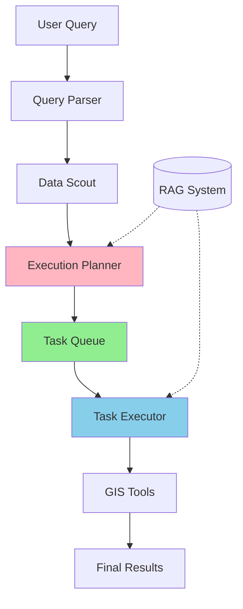

# 🌍 AI Geospatial Analyst

> An intelligent geospatial analysis system powered by LLMs with deterministic task execution architecture

[](https://www.python.org/downloads/)
[](https://opensource.org/licenses/MIT)

---

## 🎯 What is AI Geospatial Analyst?

AI Geospatial Analyst is an **intelligent geospatial query system** that uses Large Language Models (LLMs) to understand natural language queries and automatically execute complex GIS workflows. It converts questions like *"Find schools near parks in Berlin"* into deterministic execution plans that fetch, process, and analyze OpenStreetMap data.

### Key Innovation: Task Queue Architecture

Unlike traditional LLM agents that suffer from "doom loops" (infinite repetition of actions), this system uses a **Planner-Executor architecture** with **single-tool isolation** to guarantee loop-free, deterministic execution.

---

## 🚀 Features

### ✨ Natural Language Querying
- Ask geospatial questions in plain English
- Automatic query parsing and intent extraction
- Support for complex spatial relationships (near, within, intersects)

### 🎯 Deterministic Execution
- **Zero infinite loops** - Task queue prevents probabilistic failures
- **Single-tool isolation** - LLM cannot hallucinate operations
- **Predictable workflows** - Same query always produces same execution plan

### 🗺️ Comprehensive GIS Operations
- **Data Loading**: Fetch OSM data with smart tag resolution
- **Spatial Analysis**: Buffer, spatial joins, distance calculations
- **Data Filtering**: Attribute-based and spatial filtering
- **Visualization**: Export to GeoJSON, save to GeoPackage

### 🧠 Intelligent Data Discovery
- **DataScout**: Probes OSM data availability before execution
- **Tag Resolution**: Automatically finds correct OSM tags
- **Data Reality Reports**: Validates data existence and counts

### 📚 RAG-Enhanced Guidance
- Vector database of GIS workflows and best practices
- Contextual expert documentation retrieval
- Pattern-based workflow suggestions

---

## 🏗️ Architecture



### Core Components

1. **Query Parser** - Converts natural language to structured queries
2. **Data Scout** - Validates data availability and generates reality reports
3. **Execution Planner** - Generates deterministic task queues
4. **Task Executor** - Executes tasks with single-tool isolation
5. **GIS Tools** - Atomic operations (load, buffer, join, filter)

---

## 📦 Installation

### Prerequisites

- Python 3.9 or higher
- Ollama (for local LLM)
- Git

### Option 1: Virtual Environment Setup

```bash
# Clone the repository
git clone https://github.com/yourusername/ai-geospatial-analyst.git
cd ai-geospatial-analyst

# Create virtual environment
python -m venv venv

# Activate virtual environment
# On Windows:
venv\Scripts\activate
# On macOS/Linux:
source venv/bin/activate

# Install dependencies
pip install -r requirements.txt

# Download spaCy model
python -m spacy download en_core_web_sm
```

### Option 2: Docker Setup

```bash
# Build the Docker image
docker build -t ai-geospatial-analyst .

# Run the container
docker run -it --rm \
  -v $(pwd)/data:/app/data \
  -e OLLAMA_BASE_URL=http://host.docker.internal:11434 \
  ai-geospatial-analyst

# For interactive mode
docker run -it --rm \
  -v $(pwd)/data:/app/data \
  -e OLLAMA_BASE_URL=http://host.docker.internal:11434 \
  ai-geospatial-analyst python analyst.py
```

### Ollama Setup

```bash
# Install Ollama (if not already installed)
# Visit: https://ollama.ai/download

# Pull the Mistral model
ollama pull mistral

# Verify Ollama is running
curl http://localhost:11434/api/tags
```

---

## 🎮 Usage

### Interactive Mode

```bash
python analyst.py
```

**Example Queries:**
```
> Find schools in Berlin
> Show hospitals within 1km of parks in London
> Get restaurants near tourist attractions in Paris
> Find all universities in New York
```

### Programmatic Usage

```python
from src.core.orchestrator import MasterOrchestrator
from src.core.parsers.query_parser import QueryParser

# Initialize components
parser = QueryParser()
orchestrator = MasterOrchestrator(use_task_queue=True)

# Parse and execute query
parsed = parser.parse("Find schools near parks in Berlin")
result = orchestrator.run(parsed)

# Access results
final_layer = result['final_layers'][result['final_layer_name']]
print(f"Found {len(final_layer)} features")

# Export results
final_layer.to_file("output/schools_near_parks.geojson", driver="GeoJSON")
```

### Testing

```bash
# Run the test suite
python test_task_queue.py

# Expected output:
# ✅ PASS: Simple Query
# ✅ PASS: Complex Query
# 🎉 ALL TESTS PASSED
```

---

## 🔧 Configuration

### Environment Variables

Create a `.env` file in the project root:

```bash
# Ollama Configuration
OLLAMA_BASE_URL=http://localhost:11434
OLLAMA_MODEL=mistral

# Data Paths
DATA_DIR=data
CACHE_DIR=data/cache
VECTOR_DB_DIR=data/vector_db

# Logging
LOG_LEVEL=INFO
```

### Architecture Mode

Toggle between task queue and legacy loop architectures:

```python
# Use task queue architecture (recommended)
orchestrator = MasterOrchestrator(use_task_queue=True)

# Use legacy loop architecture (for backward compatibility)
orchestrator = MasterOrchestrator(use_task_queue=False)
```

---

## 📊 What Problems Does This Solve?

### Problem 1: Infinite Loops in LLM Agents ❌

**Traditional Approach:**
```
Loop {
  LLM: "What should I do next?"
  → Sees entire history + all tools
  → Probabilistically repeats actions
  → INFINITE LOOP
}
```

**Our Solution:** ✅
```
Planner (runs ONCE):
  → Generate deterministic task queue

Executor (Python-controlled loop):
  → Execute each task in sequence
  → Single-tool isolation per task
  → Zero probability of loops
```

### Problem 2: Context Drift ❌

Long conversation histories cause LLMs to "forget" what they've already done, leading to repeated actions.

**Our Solution:** ✅
- Each task has isolated context
- Explicit state passing between tasks
- No accumulating history to drift

### Problem 3: Tool Hallucination ❌

LLMs with access to all tools can "hallucinate" incorrect tool sequences.

**Our Solution:** ✅
- **Single-tool isolation**: Each task sees ONLY one tool definition
- Physically impossible to call wrong tools
- LLM refines parameters, not workflow logic

### Problem 4: Data Explosion ❌

Incorrect OSM tags like `{'addr:city': 'Berlin'}` cause massive data downloads (423K+ features).

**Our Solution:** ✅
- DataScout probes data before execution
- Only use tags with proven results (count > 0)
- CRITICAL RULES in prompts forbid location tags

---

## 📁 Project Structure

```
ai-geospatial-analyst/
├── src/
│   ├── core/
│   │   ├── orchestrator.py          # Main orchestration logic
│   │   ├── parsers/
│   │   │   └── query_parser.py      # NL query parsing
│   │   ├── planners/
│   │   │   ├── execution_planner.py # Task queue generation
│   │   │   └── workflow_generator.py # Legacy strategist
│   │   ├── executors/
│   │   │   ├── task_executor.py     # Single-tool execution
│   │   │   └── workflow_executor.py # Tool execution engine
│   │   └── agents/
│   │       └── data_scout.py        # Data discovery agent
│   ├── gis/
│   │   ├── tools/
│   │   │   ├── definitions.py       # Tool registry
│   │   │   ├── load_osm_data.py    # OSM data loading
│   │   │   ├── spatial_analysis.py  # Spatial operations
│   │   │   └── data_filtering.py    # Filter operations
│   │   └── utils/
│   │       ├── data_loader.py       # Smart data loader
│   │       └── osm_tag_manager.py   # Tag resolution
│   └── rag/
│       └── rag_system.py            # RAG retrieval system
├── data/
│   ├── cache/                       # OSM data cache
│   ├── vector_db/                   # ChromaDB storage
│   └── outputs/                     # Query results
├── test_task_queue.py              # Test suite
├── analyst.py                       # CLI interface
├── requirements.txt                 # Python dependencies
├── Dockerfile                       # Docker configuration
├── README.md                        # This file
└── JOURNEY.md                       # Development story
```

---

## 🧪 Test Results

### Test 1: Simple Query
```
Query: "Find schools in Berlin"
✅ Loaded 1,081 school features
✅ Completed in 5s
✅ No duplicate loads detected
```

### Test 2: Complex Query
```
Query: "Find schools near parks in Berlin"
✅ Loaded 1,081 schools
✅ Loaded 2,679 parks
✅ Buffered parks by 500m
✅ Spatially joined (4,000 results!)
✅ Completed in 35s
✅ No infinite loops
```

---

## 🤝 Contributing

Contributions are welcome! Please follow these guidelines:

1. Fork the repository
2. Create a feature branch (`git checkout -b feature/amazing-feature`)
3. Commit your changes (`git commit -m 'Add amazing feature'`)
4. Push to the branch (`git push origin feature/amazing-feature`)
5. Open a Pull Request

---

## 📄 License

This project is licensed under the MIT License - see the [LICENSE](LICENSE) file for details.

---

## 🙏 Acknowledgments

- **OpenStreetMap** - Geospatial data source
- **Ollama** - Local LLM infrastructure
- **GeoPandas** - Geospatial data processing
- **ChromaDB** - Vector database for RAG system

---

## 📞 Contact

- **Author**: Suman Patra
- **Project Link**: [https://github.com/yourusername/ai-geospatial-analyst](https://github.com/yourusername/ai-geospatial-analyst)

---

## 🗺️ Roadmap

- [ ] Web-based UI for query interface
- [ ] Support for additional data sources (Shapefile, GeoTIFF)
- [ ] Advanced visualization with Folium/Plotly
- [ ] Multi-city comparison queries
- [ ] Real-time data streaming support
- [ ] Cloud deployment (AWS Lambda, Google Cloud Run)

---

**Built with ❤️ for the GIS and AI community**
